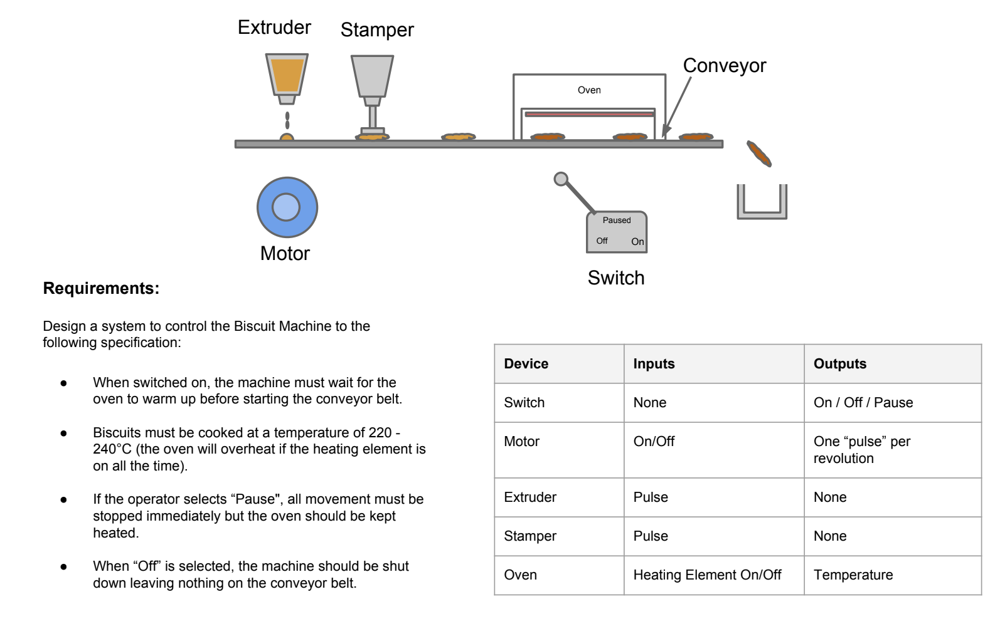

# Project Biscuit Machine

## Requirements

## Description
Showcases the functionality of the Biscuit Machine written in JS.
The main function that is responsible for how the machine operates is `setBiscuitMachineState`. As per requirements it accepts one of the following values: 'on', 'pause', 'off'.

## How to use
Put the content of `biscuitMachine.js` into the console of a browser of your choice.
In order to start the program run in the console `setBiscuitMachineState('on')`. This starts the heating process and when the suitable temperature for baking is reached the machine starts producing biscuits.
You can also play around with the machine, setting it to `pause` or `off` by adding `setBiscuitMachineState('pause')` or `setBiscuitMachineState('off')` in the console. Several console logs have already been put in place so you could monitor the baking process as you play with the machine.

Happy baking 🍪
